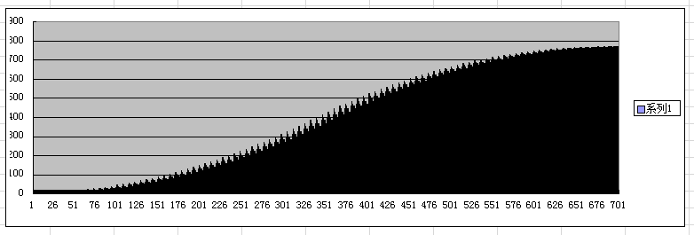
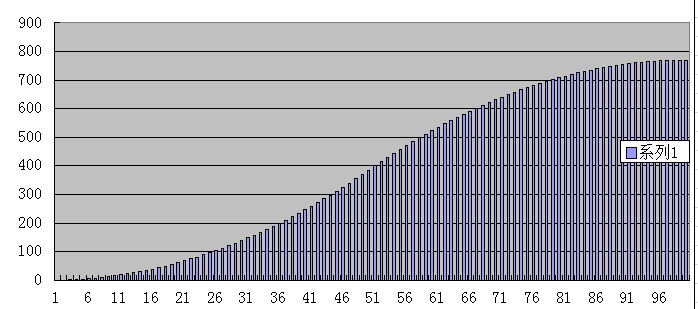

mouseWheel
==========

a demo of the event "mouseWheel"
##涉及知识点：
> * 关于元素所在位置的若干属性
> * 关于滚轮事件的兼容
> * 一个挫得不能再挫的库，要优化（TODO）
> * 关于IE下滚轮连续滚动时产生的页面抖动

question & solution:
关于IE下滚轮连续滚动时产生的页面抖动：
这是由于连续发出的pagedown和pageup请求所致，虽然在这两者调用的animate中清除了interval，
但实际测试该操作似乎不足以解决问题，或者我干脆认为没解决任何问题。

测试：在不进行animate判断时，一次鼠标滚动足以生成700次执行
在进行animate判断后，一次鼠标滚动只会生成100次执行，而这才是正确的执行次数。

为什么会有700次执行，而实际上，在animate判断前，在clearInterval以后如果打印出"animate",那么同样也会有6、7次输出。
因为每次按笔者每次正常的轮滚滑行，会触发七次mousewheel事件。而这7次毫无疑问跳过clearInter直接被传递到setInterval.
所以我们看到了一次正常滚轮产生700次请求的问题。

进一步将go输出，并列成表格，可以看到其中数据并非是i+1永远大于i的趋势，其中代表变化的go值出现很多往复现象，而这也是表现在浏览器中的
“抖动”。

700次：

100次：

PS：今天先这样...后续优化...
